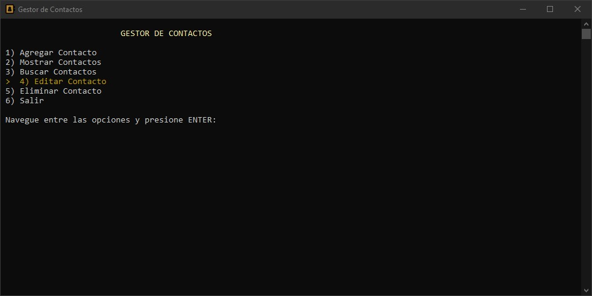
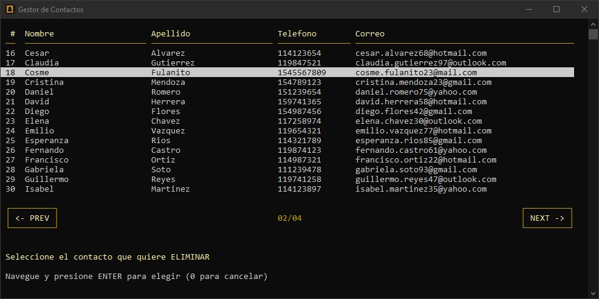
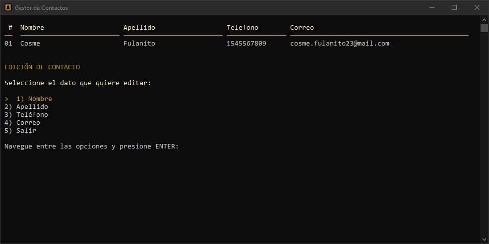

# Gestor de Contactos
Programa de consola que gestiona el nombre, apellido, teléfono y correo de distintas contactos de personas, guardándolos en un archivo para ser visualizados, editados o removidos posteriormente.

## Características

- Añade contactos ingresando los siguientes datos:
  - Nombre
  - Apellido
  - Número de teléfono
  - Correo electrónico
- Busca un contacto especificando el nombre de la persona.
- Edita datos de los contactos ya existentes.
- Visualiza todos los contactos almacenados.
- Los contactos se ordenan alfabéticamente por nombre y apellido.
- Los datos persisten al cerrar el programa.
- Elimina contactos.

## Instalación

Después de descargar o clonar el repositorio, se debe compilar el código con GCC. 

#### Usando Makefile
Para usar este método, además de GCC, debe estar disponible la herramienta "Make". Todos los comandos necesarios serán ejecutados de forma automática.
```bash
make gestor
```
#### Compilar manualmente
Comandos necesarios para compilar manualmente el proyecto:
```bash
mkdir -p ./build
windres res/resource.rc -O coff -o build/resource.o
gcc -I./include -c src/main.c -o build/main.o
gcc -I./include -c src/menu.c -o build/menu.o
gcc -I./include -c src/consola.c -o build/consola.o
gcc -I./include -c src/contact.c -o build/contact.o
gcc -I./include -c src/list.c -o build/list.o
gcc -I./include -c src/draw.c -o build/draw.o
gcc -o gestor ./build/main.o ./build/menu.o ./build/consola.o ./build/contact.o ./build/list.o ./build/draw.o ./build/resource.o -I./include
```

## Capturas



